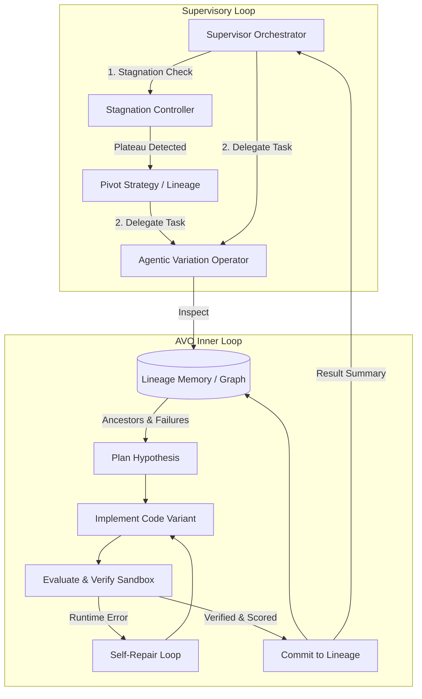

# NVIDIA AVO: Agentic Variation Operators Harness

An implementation of the **Agentic Variation Operators (AVO)** architecture introduced in the NVIDIA research paper:
> **"AVO: Agentic Variation Operators for Autonomous Evolutionary Search"** (arXiv:2603.24517)  
> *Terry Chen, Zhifan Ye, Bing Xu, et al. (NVIDIA)*

---

## Architectural Overview

Traditional evolutionary algorithms (Genetic Algorithms, Quality-Diversity, MAP-Elites) rely on fixed, hand-crafted heuristic variation operators (e.g., uniform random mutation, 1-point crossover, or naive single-shot LLM prompts). 

**NVIDIA AVO** replaces static heuristic variation operators with **autonomous, self-directed coding agents**.



---

## Core Pillars of AVO

### 1. Persistent Lineage Graph
Tracks candidate solutions as a Directed Acyclic Graph (DAG), capturing:
- Parent-child derivation relationships (`DERIVED_FROM`)
- Optimization hypotheses
- Empirical fitness scores and profiling metrics
- Execution logs and failure modes

### 2. Inner Operator Loop (Inspect $\rightarrow$ Plan $\rightarrow$ Implement $\rightarrow$ Evaluate/Repair)
- **Inspect**: Evaluates ancestor performance, hardware bottlenecks, and prior failure modes.
- **Plan**: Formulates concrete hypotheses prior to code generation.
- **Implement**: Authors source modifications.
- **Evaluate & Self-Repair**: Executes code within a sandbox to verify correctness and compute objective metrics. If exceptions or failures occur, the operator self-repairs iteratively before yielding.

### 3. Supervisory Oversight & Stagnation Controller
Monitors global fitness dynamics across generations. If scores plateau over $N$ iterations, the supervisor intervenes to re-route search direction, inject diversity, or branch from alternative lineages.

---

## Getting Started

### Prerequisites & Installation

1. **Clone & Install Dependencies** using `uv`:
   ```bash
   uv sync
   ```

2. **Configure Environment Variables**:
   Copy the example environment file:
   ```bash
   cp .env.example .env
   ```
   Edit `.env` if you wish to customize your Neo4j password or connection settings.

### LLM via Ollama (Local vs Cloud Switching)

You can toggle between local Ollama and Ollama Cloud using the `OLLAMA_MODE` environment variable (`local` or `cloud`):

**Option 1: Local Mode (`OLLAMA_MODE="local"` or default)**
Ensure Ollama is running locally:
```bash
ollama run gemma4:e2b-mlx
```
Environment settings in `.env`:
```bash
OLLAMA_MODE=local
OLLAMA_LOCAL_MODEL=gemma4:e2b-mlx
OLLAMA_LOCAL_BASE_URL=http://localhost:11434
```

**Option 2: Cloud Mode (`OLLAMA_MODE="cloud"`)**
Configure Ollama Cloud credentials in `.env`:
```bash
OLLAMA_MODE=cloud
OLLAMA_CLOUD_MODEL=llama3.3
OLLAMA_CLOUD_BASE_URL=https://api.ollama.com
OLLAMA_API_KEY="your_ollama_cloud_api_key"
```

### Neo4j Graph Database (Docker Compose)
To persist and visualize the evolutionary lineage DAG:

1. **Start Neo4j**:
   ```bash
   docker compose up -d
   ```

2. **Access the Visual Graph Browser**:
   Open [http://localhost:7474](http://localhost:7474) in your browser.
   - **Authentication**: Connect with the credentials configured in `.env` (default user: `neo4j`).

3. **Stop the Database**:
   ```bash
   docker compose down
   ```

### Running the Harness
Run the AVO harness using `uv`:
```bash
uv run python main.py
```

